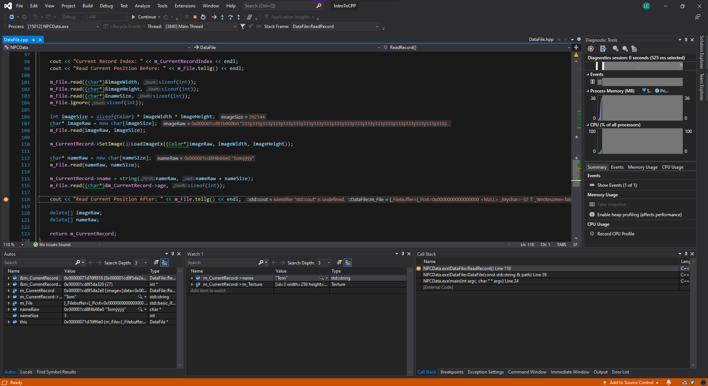

# Intro To C++
Lewis Comstive (*s210314*)

## Compilation Instructions
This project uses [CMake](https://cmake.org) for platform-independant configuration.

> If you are using `Visual Studio 2019` and do not have `CMake`,
> You can use the pre-built solution files in `VS2019-Build`

## Projects
### Tic Tac Toe


Pieces are placed using a letter-number combination (*e.g. A2, C3*)

> UTF-8 support can be enabled either through CMake when configuring (*see below image*),
> or by defining `TTT_UTF8_SUPPORT` in a header file.


##### Command Line Arguments

`--board-size=<size>`
The width and height of the square board

> Default board size is 3
> 
> Range is 3 - 26

<br>

`--player-count=<count>`
Human player count

> Default human player count is 2
>
> Range is 0 - 5
> 
> Total human and computer controlled player count cannot exceed 5

<br>

`--ai-players=<count>`
Computer-controlled players

> Default computer player count is 0
>
> Range is 0 - 5
> 
> Total human and computer controlled player count cannot exceed 5

### Highscore Database

A database containing usernames and scores.

Ability to add, remove, sort, search and alter players is present.

> Sorting uses the QuickSort algorithm
>
> Searching is done using a Binary search algorithm

Database is stored in a binary file with the following format:

```cpp
unsigned int playerCount 	 // 4 bytes
for i < playerCount
	unsigned int playerScore // 4 bytes
	string playerUsername	 // 16 bytes
```

> Usernames are limited to a maximum of 16 characters
>
> Scores are a 32-bit unsigned integer, ranging from 0 - (2^32-1) 


### NPC Data Preview

Views NPC data from a local binary file.
An example file is included with the source files.

Press the left and right arrow keys to navigate between NPC data,
or press a number 1-9 to select NPC at index.


File format is expected as follows:
```cpp
int recordCount // 4 bytes
for i < recordCount
	int imageWidth		// 4 bytes - Width of sprite
	int imageHeight		// 4 bytes - Height of sprite
	int nameSize		// 4 bytes - Length of username
	int ageSize			// 4 bytes - Length of age variable (ALWAYS EQUAL TO SIZEOF(INT))
	char* imageData		// ? bytes - Sprite data
	char* name			// ? bytes - Username
	int age				// 4 bytes - Age
```

> Raylib v3.7.0 (OpenGL 3.3) is used for displaying text and sprites
>
> Image Data is uncompressed RGBA pixel data,
>  with each colour component being stored in a byte

##### Tests

| Action | Expected | Correct? |
| -----: | -------- | :----- |
| Press left arrow | Previous NPC is loaded | Yes |
| Press number `3` | Selects NPC at index 3 | Yes |
| No NPC data file | Error message is shown and application closes | Yes |

##### Debugging


Visual Studio Keybindings (*customisable*)
 - Step Into - `F11`
 - Step Over - `F10`
 - Step Out  - `SHIFT + F11`

### Cellular Automata

This was a test project, incomplete and crashes often.


Crashes seem to be related to updating a texture representing all particles in the world.
"Framebuffers" have been added to try and counteract this by only writing to an unused texture, but this proved unsuccessful.

Press left mouse button to add sand at cursor position, or right mouse button for water.

> Particle rules check their left side first, so are very biased to go left where possible

# License
These projects are licensed under the [MIT LICENSE](./LICENSE).